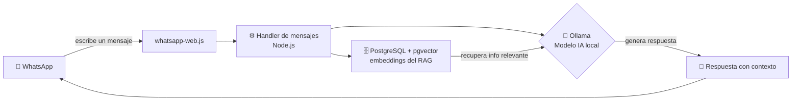

<div align="center">

# 🤖 Wa-Assistant RAG

**Asistente de WhatsApp con IA local. Responde sobre tus propios documentos usando Ollama + RAG.**

Conecta un bot a tu WhatsApp escaneando un código QR. El bot entiende preguntas en español y genera respuestas con contexto real extraído de tus documentos (PDF, TXT, etc.), todo ejecutándose de forma **100% local y privada**.

---

[](https://nodejs.org)
[](https://podman.io)
[](https://ollama.com)
[](https://github.com/pgvector/pgvector)


</div>

---

## ✨ ¿Qué hace este proyecto?

**Wa-Assistant RAG** es un chat-bot de WhatsApp que responde preguntas usando **modelos de inteligencia artificial que corren en tu propia computadora** (vía Ollama) y una técnica llamada **RAG** (_Retrieval-Augmented Generation_, es decir, "generación aumentada por recuperación").

La idea es simple pero poderosa:

1. **Tú cargas tus documentos** (por ejemplo, un manual, una guía, apuntes, un libro de texto).
2. El bot **"aprende"** de ese contenido, lo convierte en vectores y lo guarda en una base de datos.
3. Cuando alguien **le pregunta por WhatsApp**, el bot busca la información más relevante dentro de tus documentos y la usa como contexto para generar una respuesta precisa y en español.

> **En pocas palabras:** es como tener un asistente que se leyó todos tus documentos y puede responder dudas sobre ellos desde tu WhatsApp, sin depender de servidores externos ni enviar tu información a la nube.

---

## 🚀 Características principales

| | |
|---|---|
| 🔒 **Privacidad total** | La IA corre localmente con Ollama. Tus documentos y conversaciones **nunca salen** de tu máquina. |
| 📚 **RAG sobre tus documentos** | El bot responde con contexto real extraído de tus archivos, no solo de conocimiento general. |
| ⚡ **Conexión en 1 minuto** | Escanea un código QR con tu WhatsApp y el bot queda conectado al instante. |
| 🐳 **Todo con Podman** | La base de datos (PostgreSQL + pgvector) se levanta con un solo comando, sin instalar nada manualmente. |
| 🇪🇸 **Pensado para español** | El sistema, los prompts y las respuestas están configurados para trabajar en español. |
| 🧩 **Arquitectura modular** | Código organizado por capas (config, base de datos, IA, mensajes, RAG) para que sea fácil de ampliar. |

---

## 🧠 ¿Cómo funciona por dentro?

Cuando un usuario le escribe al bot en WhatsApp, ocurre lo siguiente:



### Paso a paso

1. **El usuario envía un mensaje** por WhatsApp al número donde está conectado el bot.
2. **whatsapp-web.js** recibe el mensaje y lo pasa al servidor Node.js.
3. El **handler de mensajes** decide qué hacer: si es un saludo simple, responde directo; si es una pregunta, consulta el sistema RAG.
4. El **sistema RAG** busca en PostgreSQL (con pgvector) los fragmentos de tus documentos más relevantes a la pregunta.
5. **Ollama** recibe la pregunta **más esos fragmentos como contexto** y genera una respuesta precisa y fundamentada.
6. La respuesta se envía de vuelta al usuario por WhatsApp.

> Todo este flujo ocurre en tu propia computadora. No se usa ninguna API de pago ni se comparten datos con terceros.

---

## 🛠️ Tecnologías utilizadas (Stack)

| Tecnología | Versión | Rol en el proyecto |
|---|---|---|
| [Node.js](https://nodejs.org) | 20+ | Runtime donde corre el bot y toda la lógica. |
| [whatsapp-web.js](https://wwebjs.dev) | última | Biblioteca open-source que conecta el bot con WhatsApp mediante código QR. |
| [Ollama](https://ollama.com) | última | Motor de IA local. Genera las respuestas y los embeddings (vectores). |
| [PostgreSQL](https://www.postgresql.org) | 16 | Base de datos principal, donde se guardan documentos y configuraciones. |
| [pgvector](https://github.com/pgvector/pgvector) | última | Extensión de PostgreSQL que permite búsqueda vectorial (clave para el RAG). |
| [Podman](https://podman.io) | 4+ | Contenedor que levanta PostgreSQL + pgvector de forma aislada y reproducible. |

> **¿Por qué Podman y no Docker?** Podman es un motor de contenedores de código abierto, **daemonless** (más ligero) y compatible con los mismos archivos `docker-compose.yml`. Es una alternativa moderna y segura a Docker.


## 📋 Requisitos previos

Antes de empezar, asegúrate de tener instaladas estas herramientas en tu computadora. Son **tres** y todas son gratuitas.

| Herramienta | ¿Para qué sirve? | ¿Cómo verifico que está instalada? | Descargar |
|---|---|---|---|
| **Node.js 20+** | Ejecuta el bot (el cerebro del proyecto). | `node -v` | [nodejs.org](https://nodejs.org) |
| **Ollama** | Proporciona el modelo de IA local. | `ollama --version` | [ollama.com/download](https://ollama.com/download) |
| **Podman** | Levanta PostgreSQL + pgvector en un contenedor. | `podman --version` | [podman.io](https://podman.io/docs/installation) |

> **Consejo:** Si usas Windows, Podman se instala junto con *Podman Desktop* (una interfaz gráfica opcional pero muy cómoda). Docker Desktop también funciona, ya que el proyecto es compatible con ambos.

### Verificación rápida

Abre una terminal (PowerShell) y ejecuta estos tres comandos. Deberías ver una versión en cada uno:

```powershell
node -v        # → v20.x.x o superior
ollama --version
podman --version
```

Si alguno de los tres falla, instálalo antes de continuar con la instalación.

---

## 🚦 Quickstart (Puesta en marcha en menos de 2 minutos)

Sigue estos pasos **en orden**. Cada paso indica lo que deberías ver para saber que vas bien.

```bash
# 1. Clona el repositorio en tu máquina
git clone https://github.com/TU_USUARIO/wa-assistant-rag.git
cd wa-assistant-rag

# 2. Levanta PostgreSQL + pgvector con Podman (en segundo plano)
podman compose up -d

# 3. Descarga el modelo de IA local (una sola vez)
ollama pull llama3.2

# 4. Instala las dependencias del proyecto
npm install

# 5. Crea tu archivo de configuración
copy .env.example .env

# 6. Arranca el bot — aparecerá un código QR
npm run dev
```

### ✅ ¿Cómo sé que todo funciona?

1. **Paso 2:** verás una línea que dice `Container ... Started` (el contenedor de la base de datos está corriendo).
2. **Paso 3:** la descarga del modelo avanza con una barra de progreso.
3. **Paso 6:** en la terminal aparece un **código QR**.
4. **Abre WhatsApp en tu celular** → Menú (⋮) → **Dispositivos vinculados** → **Vincular un dispositivo** → escanea el QR.
5. Envía **"hola"** al número del bot. Deberías recibir una respuesta en menos de 3 segundos.


---

## ⚙️ Configuración (variables de entorno)

Toda la configuración vive en un archivo `.env` que **tú creas** (nunca se sube al repositorio). Empieza copiando `.env.example` y edita los valores.

```env
# ---- Base de datos (PostgreSQL + pgvector) ----
PGHOST=localhost
PGPORT=5432
PGUSER=postgres
PGPASSWORD=tu_password_segura
PGDATABASE=wa_assistant

# ---- Modelo de IA (Ollama) ----
OLLAMA_HOST=http://localhost:11434
OLLAMA_MODEL=llama3.2
EMBEDDING_MODEL=nomic-embed-text
```

### Explicación de cada variable

| Variable | Descripción | Valor de ejemplo |
|---|---|---|
| `PGHOST` | Dónde corre la base de datos. | `localhost` |
| `PGPORT` | Puerto de conexión de PostgreSQL. | `5432` |
| `PGUSER` | Usuario de la base de datos. | `postgres` |
| `PGPASSWORD` | Contraseña del usuario (¡cámbiala!). | `tu_password_segura` |
| `PGDATABASE` | Nombre de la base de datos. | `wa_assistant` |
| `OLLAMA_HOST` | Dirección del servicio de Ollama. | `http://localhost:11434` |
| `OLLAMA_MODEL` | Modelo que genera las respuestas. | `llama3.2` |
| `EMBEDDING_MODEL` | Modelo que convierte texto en vectores. | `nomic-embed-text` |

> **Importante:** Nunca subas tu archivo `.env` al repositorio. Siempre está protegido por el `.gitignore`. La primera vez debes descargar también el modelo de embeddings: `ollama pull nomic-embed-text`.

---

## 📚 Documentación completa

Para entender a fondo cada parte del proyecto, entra en los documentos de la carpeta `docs/`:

| Documento | Contenido |
|---|---|
| [docs/01_architecture.md](docs/01_architecture.md) | Arquitectura del sistema, componentes y diseño. |
| [docs/02_setup_and_env.md](docs/02_setup_and_env.md) | Instalación detallada, configuración del entorno y primer uso. |
| [docs/03_rag_pipeline.md](docs/03_rag_pipeline.md) | Cómo funciona el RAG: ingesta, embeddings, y búsqueda. |
| [docs/04_ollama_config.md](docs/04_ollama_config.md) | Modelos recomendados y configuración de Ollama. |
| [docs/05_whatsapp_webjs.md](docs/05_whatsapp_webjs.md) | Conexión con WhatsApp, sesión y manejo de mensajes. |
| [docs/06_cloud_api_migration.md](docs/06_cloud_api_migration.md) | Migración futura a la WhatsApp Cloud API de Meta. |
| [docs/07_testing.md](docs/07_testing.md) | Estrategia y guía de pruebas. |
| [docs/08_roadmap.md](docs/08_roadmap.md) | Plan de trabajo (metodología Scrum) y MVP. |

---

## 🗂️ Estructura del repositorio

```
wa-assistant-rag/
├── src/                  # Código fuente del bot
│   ├── index.js          #   Punto de entrada principal
│   ├── config.js         #   Carga y validación de configuración
│   ├── db.js             #   Conexión a PostgreSQL
│   ├── ollama.js         #   Cliente de Ollama (IA)
│   ├── handlers/         #   Lógica de los mensajes entrantes
│   │   └── message.js
│   └── rag/              #   Sistema RAG (ingesta y búsqueda)
│       ├── ingest.js
│       └── search.js
├── docs/                 # Documentación completa en español
├── scripts/              # Scripts auxiliares (SQL de inicialización)
│   └── init-db.sql
├── tests/                # Pruebas automatizadas
├── container/            # Recursos de Podman/Contenedores
├── docker-compose.yml    # Definición de PostgreSQL + pgvector
├── .env.example          # Plantilla de configuración
└── README.md             # Este documento
```

---

## 🗺️ Roadmap

El proyecto se desarrolla con **metodología Scrum**. El MVP (producto mínimo viable) ya está definido y priorizado en el [roadmap](docs/08_roadmap.md):

- ✅ **Historia 1:** Conectar el bot a WhatsApp escaneando un QR.
- ✅ **Historia 2:** Responder a un saludo ("hola") en menos de 3 segundos.
- ✅ **Historia 3:** Responder preguntas usando el contenido de los documentos cargados.
- ⏳ **Historia 4:** Cargar documentos (PDF/TXT) a la base de datos.
- ⏳ **Historia 5:** Cambiar el modelo de IA con una variable de entorno.

Consulta [docs/08_roadmap.md](docs/08_roadmap.md) para ver las fases, tareas y criterios de "terminado".

---

## 🤝 Contribuciones

¿Quieres colaborar o darle mantenimiento al proyecto? ¡Genial! Revisa primero la guía de contribución:

- **[CONTRIBUTING.md](CONTRIBUTING.md)** — cómo empezar, buenas prácticas, flujo de trabajo y metodología Scrum.

Normas básicas:
1. Usa **ramas de feature** (`feature/nombre`) en lugar de trabajar directo en `main`.
2. Escribe mensajes de commit claros en español o inglés (`feat: ...`, `fix: ...`, `docs: ...`).
3. Crea un **Pull Request** y espera la revisión antes de fusionar.

---

## ❓ Solución de problemas (Troubleshooting)

| Problema | Posible causa | Solución |
|---|---|---|
| El QR no aparece al ejecutar `npm run dev` | Falta la carpeta de sesión o hubo un error de WhatsApp | Borra la carpeta `.wwebjs_auth` y vuelve a ejecutar |
| El bot se desconecta después de un tiempo | La sesión de WhatsApp Web expiró | Reescanea el QR reiniciando el bot |
| La base de datos no conecta | El contenedor de Podman no está corriendo | Ejecuta `podman compose up -d` |
| "Model not found" al responder | No descargaste el modelo de Ollama | Ejecuta `ollama pull llama3.2` y `ollama pull nomic-embed-text` |
| El puerto 5432 está ocupado | Otro servicio usa ese puerto | Cambia `PGPORT` en tu `.env` y en `docker-compose.yml` |
| El contenedor no ve la carpeta de documentos | Volumen de datos mal montado | Revisa los volúmenes en `docker-compose.yml` |

---

## 📄 Licencia

Este proyecto está bajo la licencia **MIT**. Puedes usarlo, modificarlo y distribuirlo libremente.

---

## 🙏 Agradecimientos y referencias

Este proyecto se apoya en excelentes herramientas open-source:

- [Ollama](https://ollama.com) — ejecución local de modelos de IA.
- [whatsapp-web.js](https://wwebjs.dev) — conexión con WhatsApp.
- [pgvector](https://github.com/pgvector/pgvector) — búsqueda vectorial en PostgreSQL.
- [Podman](https://podman.io) — contenedores ligeros y seguros.
